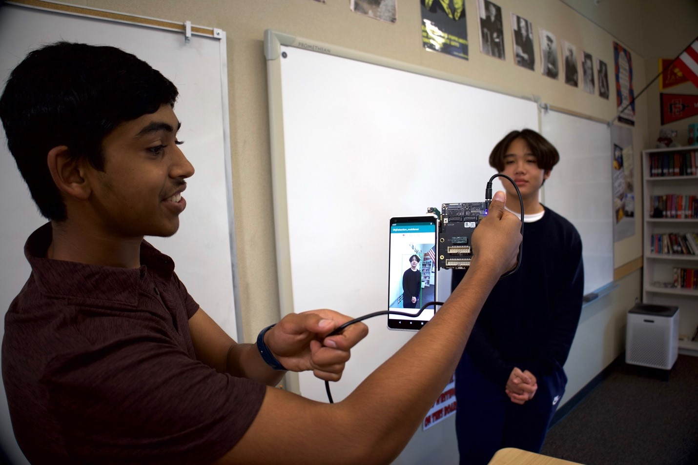
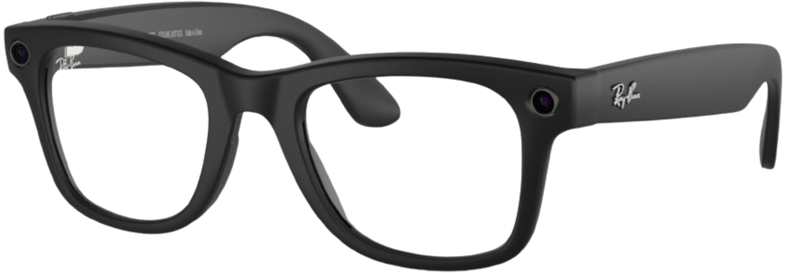

## Navigation
- [Home](https://soundforsight.github.io/hope/)
- [Impact](https://soundforsight.github.io/hope/impact)
- [Innovation](https://soundforsight.github.io/hope/innovation)
- [Team](https://soundforsight.github.io/hope/team)

# Impact

The white cane is still the most commonly used device to assist the visually impaired. Imagine how life-changing a technological alternative would be in creating a more accessible world. Our application offers a more affordable and serviceable alternative, promoting inclusivity and self reliance. 

In addition, visually impaired individuals are not able to react as well to external hazards than non visually impaired people. In a summary of the pre existing studies on this topic,  scholars found visually impaired persons are 1.7 times more likely to suffer a fall, and 1.9 times more likely to suffer recurring falls, which can be devastating for older persons. Our product will use the latest machine vision technology to protect consumers from suffering these incidents.

As we envision the future of our innovation, we are actively exploring integration possibilities including the Meta Glasses. The integration of our application into such advanced wearable devices will aim to provide visually impaired users with an immersive and enhanced experience, leveraging features such as hands-free navigation. The most crucial aspect of our project is its ability to progress, which will ensure that our assistive technology meets the evolving needs of our audience. We recognize the importance of staying receptive to feedback, embracing emerging technologies, and refining our solutions in the future as we understand how valuable our project is to millions of people. 

